<div align="center">
  
  <h1>Papers-Go</h1>
  <p>刷论文，找方向，与智能助手一起读懂研究。</p>
  <p>
    <a href="https://github.com/cyhcyh/Papers-Go"></a>
    <a href="LICENSE"></a>
    <a href="https://hub.docker.com/r/roger1001/papers-go"></a>
  </p>
</div>

Papers-Go 是一个可自行部署的论文阅读与推荐网站，提供刷视频一样的刷论文体验。同步 arXiv 和会议论文，根据兴趣推荐值得读的内容，按需生成精读卡，并结合近期论文分析研究趋势。可以使用本地 Ollama，也可以连接云端模型，管理员可为不同功能分别选择模型。

## 功能

- **刷论文**：桌面双列信息流，手机上下切换。论文卡展示原标题、中文译名、作者、推荐分，以及「研究问题」「主要贡献和结果」。支持收藏、喜欢、没兴趣和数学公式显示。
- **兴趣推荐**：按分类、主题和研究描述筛选。持续阅读和反馈用于调整推荐，游客也能浏览管理员配置的默认来源。
- **分类浏览**：按学科、arXiv 分类或会议、研究主题组织论文。支持搜索、时间筛选和主题提议，正式主题由管理员审核或直接添加。
- **论文精读**：基于论文全文生成六问精读卡，支持列表、表格和 LaTeX。后台排队生成，关闭页面后继续执行，同一论文的完成结果可供其他用户复用。
- **研究趋势**：首页简述当日研究焦点和进展，趋势页提供更完整的解读，并用近期研究作为对照。
- **智能助手**：多轮流式对话、论文检索和阅读工具。修改兴趣或监视清单时需要用户确认，工具按用户身份限制访问范围。
- **Agent Skills**：标准技能包管理，支持个人技能、共享提议、版本记录和按需加载。智能助手可制作个人技能，共享发布需要管理员批准。
- **管理后台**：站点设置、数据概览、云端 token 用量、来源与主题管理、用户管理、日志、流水线控制，以及模型、Prompts 和 Skills 配置。


## 界面预览

<p>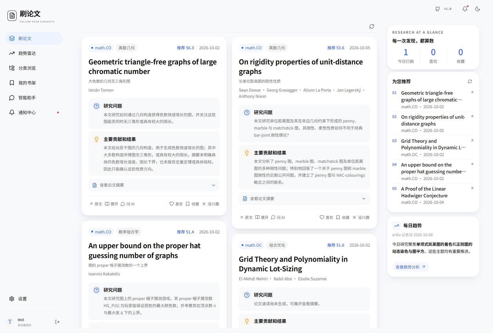 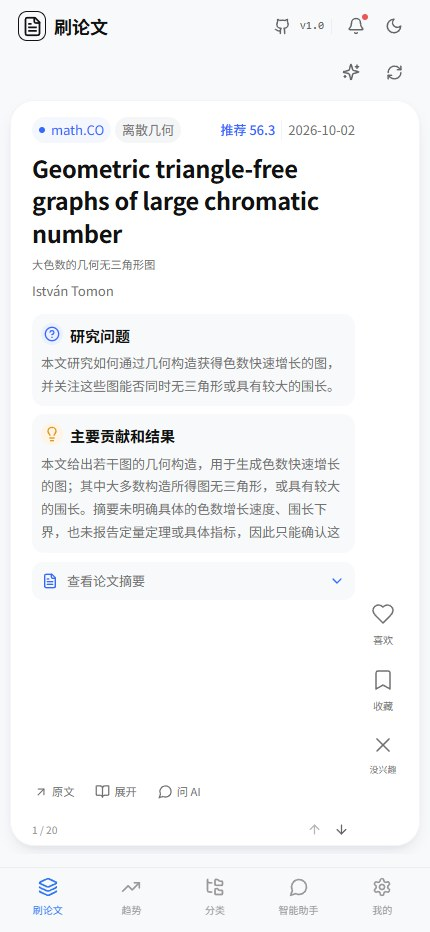</p>

<details>
<summary>手机端：刷论文、分类抽屉、精读、智能助手与趋势分析</summary>
<p> 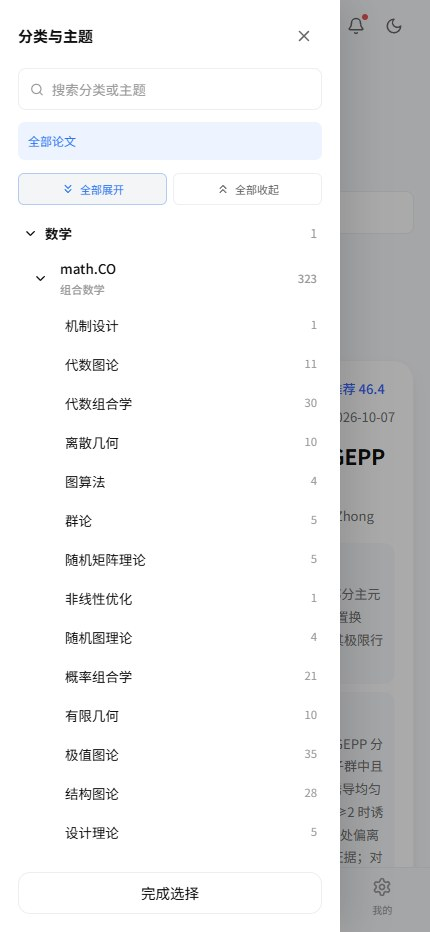</p>
<p> 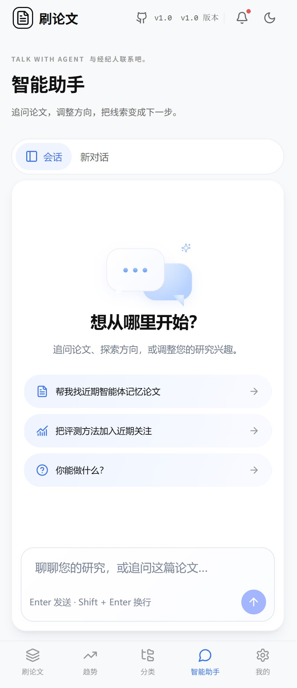</p>
<p>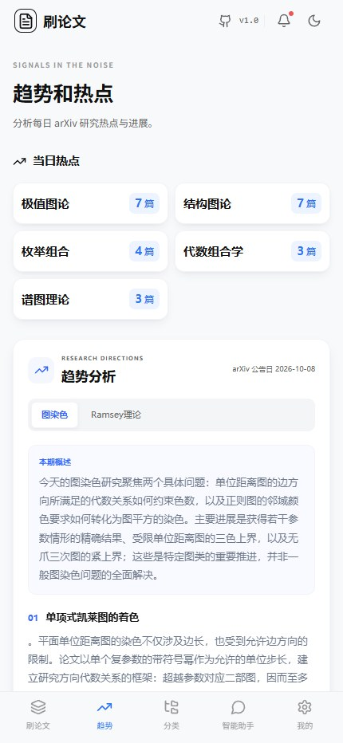</p>
</details>

<details>
<summary>分类浏览</summary>
<p>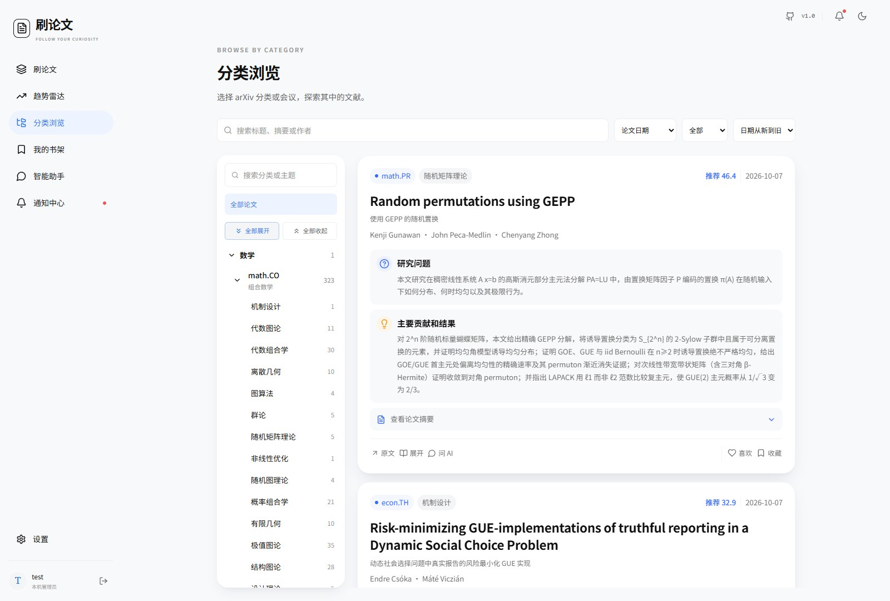</p>
</details>

<details>
<summary>论文精读卡</summary>
<p></p>
</details>

<details>
<summary>研究趋势分析</summary>
<p>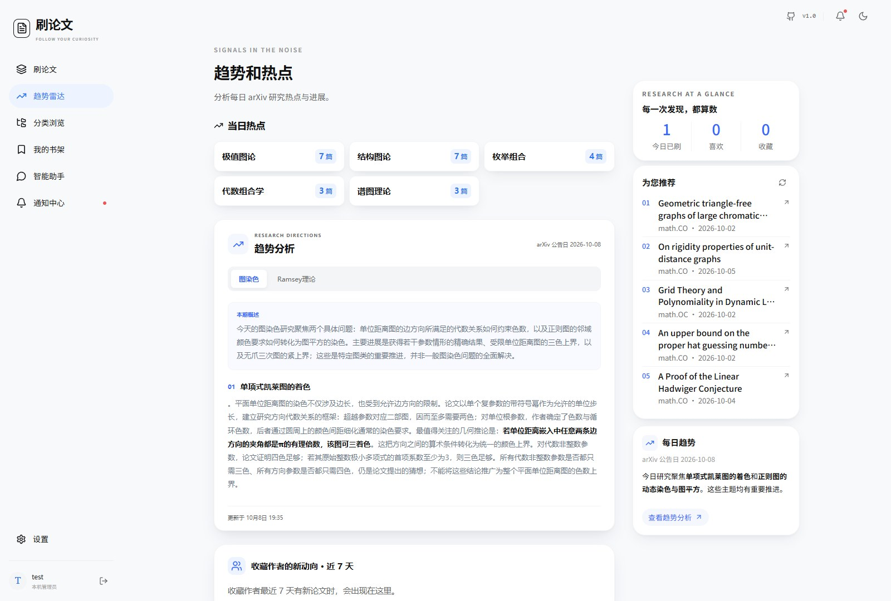</p>
</details>

<details>
<summary>智能助手</summary>
<p>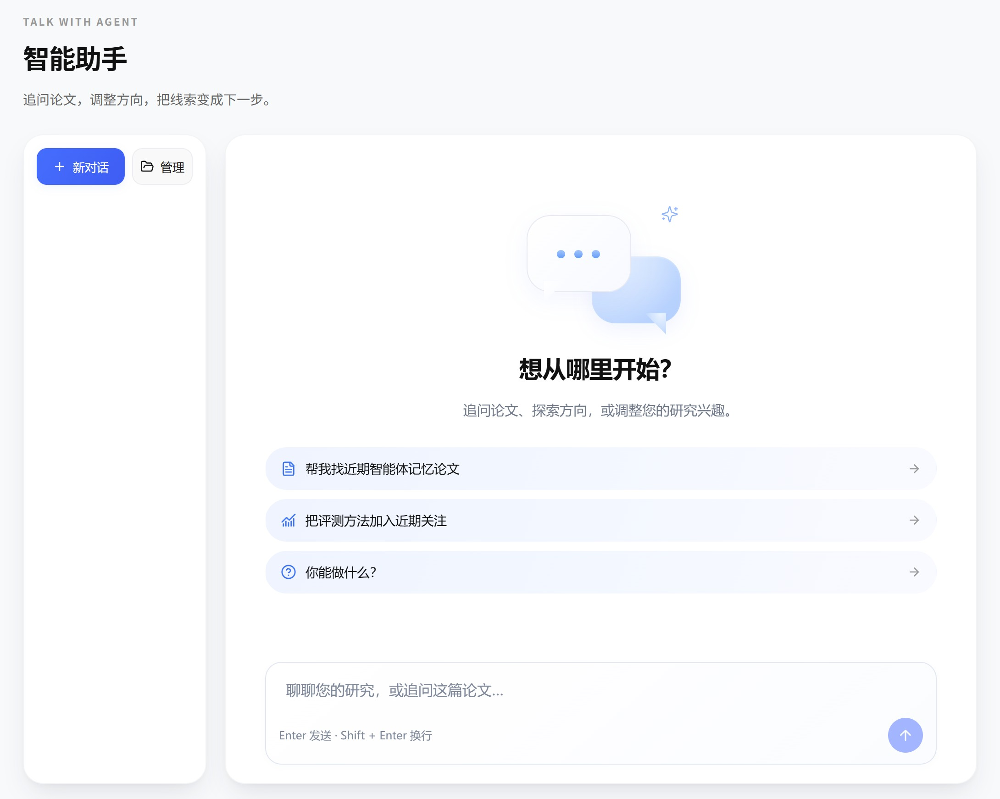</p>
</details>

<details>
<summary>管理后台概览</summary>
<p>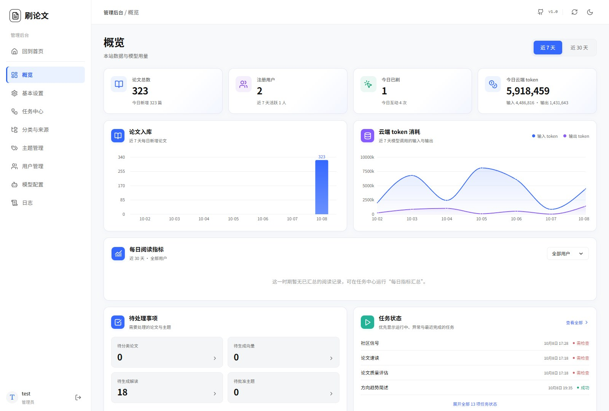</p>
</details>

<details>
<summary>主题管理</summary>
<p>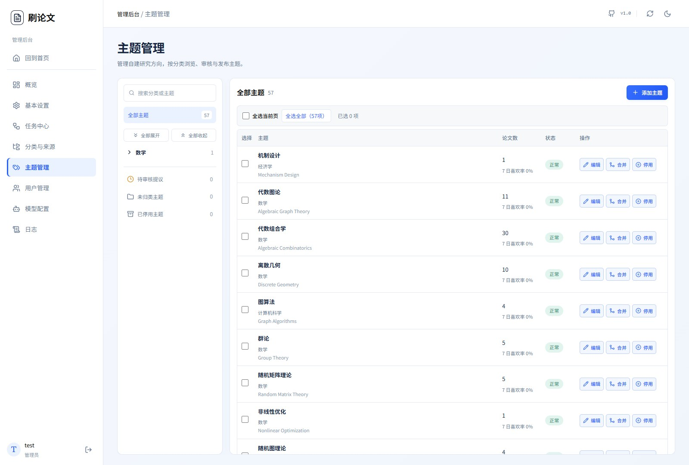</p>
</details>
<details>
<summary>管理后台模型配置</summary>
<p>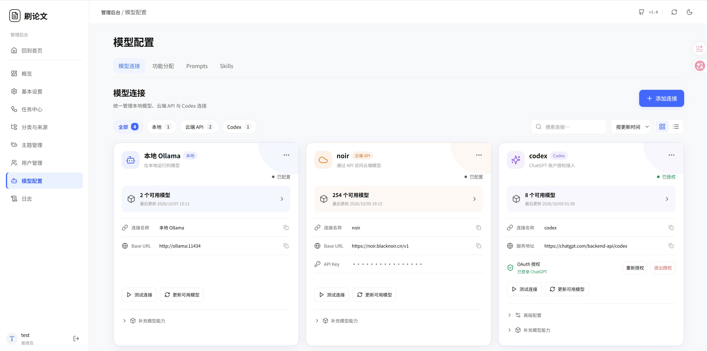 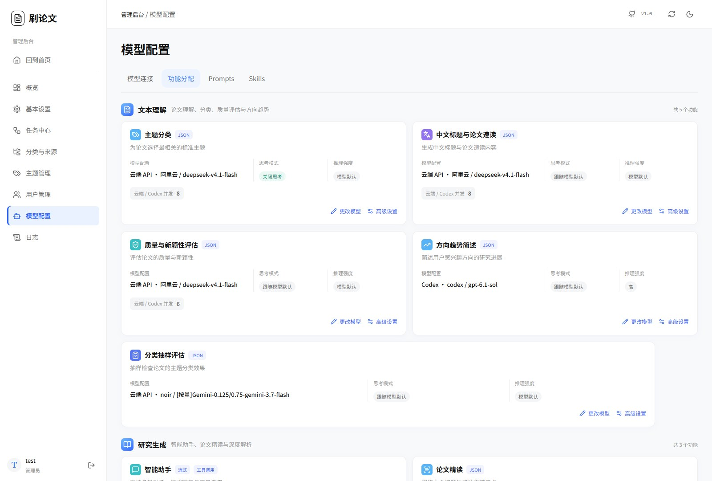</p>
</details>


## 目录

- [快速部署](#quick-start)
- [首次使用](#first-use)
- [配置说明](#configuration)
- [更新与备份](#updates-and-backups)
- [本地开发](#development)
- [技术栈与项目结构](#project-structure)
- [开源协议](#license)

<a name="quick-start" id="quick-start"></a>

## 快速部署

准备 Docker 和 Docker Compose 2.30 或更新版本。使用 [Docker Hub 镜像](https://hub.docker.com/r/roger1001/papers-go)部署，无需下载源码或在本机安装 Python、Node.js。当前镜像支持 `linux/amd64`，适用于常见 x86 Linux 服务器和使用 Linux 容器的 x86 Docker Desktop。

```bash
mkdir Papers-Go
cd Papers-Go
```

以下选择一种方式，将完整配置保存为部署目录中的 `docker-compose.yml`，然后复制对应的启动命令即可。`.env` 可选，模型连接和模型选择在管理后台配置。

### 方式一：单独部署系统

适合连接已有的 Ollama 或使用云端 API。包含网站和后台工作进程。

```yaml
name: shualunwen
services:
  app:
    image: roger1001/papers-go:latest
    ports:
      - "8000:8000"
    env_file:
      - path: .env
        required: false
    environment:
      DATA_DIR: /data
      FRONTEND_DIR: /app/frontend/dist
      MODEL_KEY_FILE: /secrets/model-keys.key
      OLLAMA_BASE_URL: ${OLLAMA_BASE_URL:-http://ollama:11434}
      TZ: ${TZ:-Asia/Shanghai}
      PIPELINE_MODE: external
    extra_hosts:
      - "host.docker.internal:host-gateway"
    volumes:
      - ./data:/data
      - ./.secrets:/secrets
    restart: unless-stopped
    healthcheck:
      test: ["CMD", "python", "-c", "import urllib.request; urllib.request.urlopen('http://localhost:8000/api/health')"]
      interval: 30s
      timeout: 5s
      retries: 3
  worker:
    image: roger1001/papers-go:latest
    command: ["python", "-m", "app.worker"]
    env_file:
      - path: .env
        required: false
    environment:
      DATA_DIR: /data
      FRONTEND_DIR: /app/frontend/dist
      MODEL_KEY_FILE: /secrets/model-keys.key
      OLLAMA_BASE_URL: ${OLLAMA_BASE_URL:-http://ollama:11434}
      TZ: ${TZ:-Asia/Shanghai}
      PIPELINE_MODE: external
    extra_hosts:
      - "host.docker.internal:host-gateway"
    volumes:
      - ./data:/data
      - ./.secrets:/secrets
    depends_on:
      app:
        condition: service_healthy
    restart: unless-stopped
```

```bash
docker compose pull
docker compose up -d
```

访问 [http://localhost:8000](http://localhost:8000)，完成首次注册后，在后台「模型配置」添加连接并分配模型。本机已有 Ollama 可在后台填写 `http://host.docker.internal:11434`，其他设备上的服务填写实际地址。Ollama 服务需允许网站容器访问。

### 方式二：系统与 Ollama 一并部署（启用 GPU）

需要可供 Docker 使用的 NVIDIA GPU。Linux 主机需要 NVIDIA Container Toolkit，GPU 配置需要 Docker Compose 2.30 或更新版本。此方式只启动 Ollama 服务，不预设或自动下载模型。

```yaml
name: shualunwen
services:
  app:
    image: roger1001/papers-go:latest
    ports:
      - "8000:8000"
    env_file:
      - path: .env
        required: false
    environment:
      DATA_DIR: /data
      FRONTEND_DIR: /app/frontend/dist
      MODEL_KEY_FILE: /secrets/model-keys.key
      OLLAMA_BASE_URL: ${OLLAMA_BASE_URL:-http://ollama:11434}
      TZ: ${TZ:-Asia/Shanghai}
      PIPELINE_MODE: external
    extra_hosts:
      - "host.docker.internal:host-gateway"
    volumes:
      - ./data:/data
      - ./.secrets:/secrets
    restart: unless-stopped
    healthcheck:
      test: ["CMD", "python", "-c", "import urllib.request; urllib.request.urlopen('http://localhost:8000/api/health')"]
      interval: 30s
      timeout: 5s
      retries: 3
  worker:
    image: roger1001/papers-go:latest
    command: ["python", "-m", "app.worker"]
    env_file:
      - path: .env
        required: false
    environment:
      DATA_DIR: /data
      FRONTEND_DIR: /app/frontend/dist
      MODEL_KEY_FILE: /secrets/model-keys.key
      OLLAMA_BASE_URL: ${OLLAMA_BASE_URL:-http://ollama:11434}
      TZ: ${TZ:-Asia/Shanghai}
      PIPELINE_MODE: external
    extra_hosts:
      - "host.docker.internal:host-gateway"
    volumes:
      - ./data:/data
      - ./.secrets:/secrets
    depends_on:
      app:
        condition: service_healthy
    restart: unless-stopped
  ollama:
    gpus: all
    image: ollama/ollama:0.11.11
    ports:
      - "${OLLAMA_BIND:-127.0.0.1}:${OLLAMA_PORT:-11434}:11434"
    environment:
      OLLAMA_NUM_PARALLEL: "1"
      OLLAMA_MAX_LOADED_MODELS: "1"
    volumes:
      - ollama:/root/.ollama
    restart: unless-stopped
volumes:
  ollama:
```

```bash
docker compose pull
docker compose up -d
```

访问 [http://localhost:8000](http://localhost:8000)。后台 Ollama 连接地址填写 `http://ollama:11434`，模型由您在 Ollama 中准备，再到后台获取模型列表并分配给各功能。这里不展开 Ollama 的部署和模型管理，相关说明见 [Ollama 官方文档](https://docs.ollama.com/docker)。

若已下载源码，仓库也提供等价的拆分配置，启动命令为：

```bash
docker compose -f docker-compose.yml -f docker-compose.ollama.yml -f docker-compose.gpu.yml pull
docker compose -f docker-compose.yml -f docker-compose.ollama.yml -f docker-compose.gpu.yml up -d
```

若本机的 `11434` 端口已被占用，可以修改 Ollama 的宿主机端口。容器内部连接地址仍为 `http://ollama:11434`。两种部署方式保留相同的项目名、数据目录和模型卷，已有部署升级时不会更换数据库或模型缓存。

### 对外提供访问

网站通过宿主机的 `8000` 端口提供访问。需要更换端口时，修改 Compose 中 `8000:8000` 的前一个端口号，例如 `8080:8000`。公开访问建议配置 HTTPS 反向代理，智能助手的 SSE 流式接口应关闭代理缓冲。PWA 安装需要 HTTPS，本机 localhost 除外。


<a name="first-use" id="first-use"></a>

## 首次使用

1. 注册第一个账号，该账号会成为管理员。注册成功后会提示随机生成的管理入口，请保存该地址，后续可在后台查看和修改。
2. 进入「基本设置」，设置网站名称、图标、描述和管理入口。
3. 在「分类与来源」添加需要的 arXiv 分类和会议，设置是否自动抓取及是否供游客浏览。新安装不会预先启用所有来源或主题。
4. 在「模型配置 → 模型连接」添加本地或云端连接，再到「功能分配」设置各功能使用的模型、思考模式和并发参数。
5. 到「任务中心」运行抓取及后续处理。各任务支持独立启停，部分生成任务支持重做，完成结果逐篇保存。
6. 普通用户登录后设置自己的兴趣，之后可刷论文、收藏、使用智能助手和生成精读卡。

管理入口使用随机地址，但身份校验和权限检查仍由后端执行。管理员可以调整用户角色、禁用账号，删除用户时会清理其个人数据。

<a name="configuration" id="configuration"></a>

## 配置说明

网站端口在 Compose 的 `ports` 中修改。时区和运行参数可在 `.env` 设置，选项见 [.env.example](.env.example)。模型连接、API Key、Ollama 地址和功能所用模型在管理后台设置。

| 配置 | 默认值 | 说明 |
| --- | --- | --- |
| `TZ` | `Asia/Shanghai` | 时区 |
| `OLLAMA_PORT` | `11434` | Ollama 宿主机端口 |
| `OLLAMA_BIND` | `127.0.0.1` | Ollama 监听地址 |
| `SCHEDULER_ENABLED` | `true` | 启用后台定时任务 |
| `BOOTSTRAP_ENABLED` | `true` | 首次启动时执行初始化流水线 |
| `REQUIRE_INVITE_CODE` | `false` | 注册是否要求邀请码 |

### 模型与指令

「模型连接」支持 Ollama、OpenAI 兼容云端接口和 Codex 设备码登录。连接可获取可用模型列表，功能分配中的主模型、备用模型和高级参数分别设置。支持的思考模式和推理强度取决于模型能力。

「Prompts」用于编辑生成指令，保存后对新调用生效。「Skills」用于管理标准技能及版本。源码中的默认 Prompt 位于 [backend/app/prompts.toml](backend/app/prompts.toml)，系统评分技能位于 [backend/app/skills/paper-quality/SKILL.md](backend/app/skills/paper-quality/SKILL.md)。后台修改不会改写这些源码文件。

### 数据与凭据

- `data/`：SQLite 数据库、用户数据、精读缓存和运行时技能文件。
- `.secrets/`：模型凭据的加密密钥，Docker 内路径为 `/secrets/model-keys.key`。
- Docker 命名卷 `shualunwen_ollama`：已下载的 Ollama 模型。

后台填写的 API Key 加密保存，页面不会回显。备份必须同时保留 `data/` 和 `.secrets/`，缺少密钥文件将无法解密原有模型凭据。`.env`、数据库和密钥不要提交到公开仓库。

日志会隐藏 API Key、Authorization 等敏感字段，保留期限可在后台设置。日志保留时间不会改变已保存凭据的有效期。

<a name="updates-and-backups" id="updates-and-backups"></a>

## 更新与备份

更新前先备份。停止网站和工作进程后，将完整的 `data/`、`.secrets/`、`docker-compose.yml` 和可选的 `.env` 复制到安全的备份目录，再启动服务。保留 `data/` 下的所有文件，不能只复制 SQLite 主文件。原数据库需要配套的密钥才能解密模型凭据。使用拆分配置时，一并备份 `docker-compose.ollama.yml` 和 `docker-compose.gpu.yml`。

```bash
docker compose stop worker app
# 在此复制 data/、.secrets/、使用中的 Compose 配置文件和可选的 .env
docker compose start app worker
```

Docker 运行期间，不要从宿主机直接用 SQLite 程序打开正在写入的数据库。日常查询和管理优先使用网站后台。

使用上面的任意一种完整 Compose 配置时，网站更新命令相同：

```bash
docker compose pull app worker
docker compose up -d --no-deps app worker
```

使用仓库的拆分 GPU 配置时，在命令中保留原来的配置文件：

```bash
docker compose -f docker-compose.yml -f docker-compose.ollama.yml -f docker-compose.gpu.yml pull app worker
docker compose -f docker-compose.yml -f docker-compose.ollama.yml -f docker-compose.gpu.yml up -d --no-deps app worker
```

这两组更新命令只更新网站和工作进程，Ollama 服务和模型缓存会保留。`latest` 跟随最新发布版本。如果需要固定版本，将 `app` 和 `worker` 的镜像标签同时改为 Docker Hub 中已发布的同一个版本。

恢复备份时，先停止网站和工作进程，将备份中的 `data/`、`.secrets/` 及配置文件还原到部署目录，再执行 `docker compose up -d`。使用拆分配置的部署仍需带上原来的 `-f` 参数。保留 Compose 项目名、卷映射和模型卷。不要使用 `docker compose down -v`，它会删除 Ollama 模型卷。命名卷中的 Ollama 模型不包含在上述目录备份中。

<a name="development" id="development"></a>

## 本地开发

准备 Git、Conda 和 Node.js 22，先下载源码：

```bash
git clone https://github.com/cyhcyh/Papers-Go.git
cd Papers-Go
```

在项目根目录执行：

```bash
conda env create --prefix ./.conda-env -f environment.yml
conda activate ./.conda-env
cp .env.example .env
```

本机开发时，在后台填写 Ollama 地址 `http://localhost:11434`，或添加云端连接，再选择各功能使用的模型。

启动后端：

```bash
python -m uvicorn app.main:app --app-dir backend --host 127.0.0.1 --port 8000 --reload
```

另开一个终端启动前端：

```bash
cd frontend
npm ci
npm run dev
```

访问 Vite 提示的地址，默认 [http://127.0.0.1:5173](http://127.0.0.1:5173)。开发代理连接后端的 `8000` 端口。

<a name="project-structure" id="project-structure"></a>

## 技术栈与项目结构

| 部分 | 技术 |
| --- | --- |
| 前端 | React、TypeScript、Vite、assistant-ui、KaTeX、Recharts |
| 后端 | Python 3.12、FastAPI、SQLite、sqlite-vec |
| 模型 | Ollama、OpenAI 兼容接口、Codex 设备码流程 |
| 部署 | Docker Compose、独立后台 worker、Conda |

```text
Papers-Go/
├── backend/                 # API、推荐、模型路由与后台流水线
│   └── app/
│       ├── prompts.toml     # 默认 Prompt
│       └── skills/          # 系统 Agent Skills
├── frontend/                # 网页与移动端界面
├── docs/images/             # 界面截图
├── docker-compose.yml       # 网站与工作进程
├── docker-compose.ollama.yml # 可选 Ollama 服务，也可单独部署
├── docker-compose.gpu.yml    # 可选 NVIDIA GPU 配置
├── .env.example             # 启动配置示例
└── LICENSE
```

<a name="license" id="license"></a>

## 开源协议

本项目采用 [GNU Affero General Public License v3.0（AGPL-3.0）](LICENSE)。分发修改版或将修改版作为网络服务提供时，请遵守该许可证对应的源码提供要求。

项目使用 PyMuPDF 等第三方依赖，各依赖的许可证分别适用。PyMuPDF 提供 AGPL 和商业授权选项，详情见 [PyMuPDF 授权说明](https://pymupdf.readthedocs.io/en/latest/about.html#license-and-copyright)。部分界面组件的第三方声明保留在 [frontend/public/third-party-ui-licenses.txt](frontend/public/third-party-ui-licenses.txt)。

欢迎通过 [Issues](https://github.com/cyhcyh/Papers-Go/issues) 反馈问题，也欢迎提交 Pull Request。
